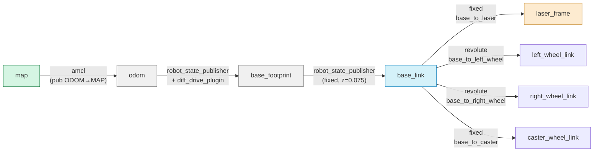

# ARCHITECTURE — Proyecto Integrador: Simulación de Navegación Autónoma

> **Propósito**: Blueprint técnico para redacción del documento LaTeX.  
> **Precedencia**: [`REQUIREMENTS.md`](REQUIREMENTS.md) (requisitos) → [`CONTEXT.md`](CONTEXT.md) (estado actual).  
> **Uso**: El Coder usará este documento para implementar [`trabajo_tenam.tex`](trabajo_tenam.tex).  
> **Stack**: ROS Noetic + Gazebo 9/11 + RViz.

---

## Índice de Contenido

1. [Diseño del Robot en Simulación (10.1)](#1-diseño-del-robot-en-simulación-101)
   - 1.1 Modelo URDF — Especificación de Links y Joints
   - 1.2 Parámetros Físicos
   - 1.3 Transmisiones y Plugins Gazebo
   - 1.4 Sensor LiDAR — Especificaciones
   - 1.5 Cinemática del Diferencial
2. [Arquitectura ROS](#2-arquitectura-ros)
   - 2.1 Diagrama de Grafos (Mermaid)
   - 2.2 Árbol de Transforms (TF Tree)
   - 2.3 Namespaces y Parámetros Globales
3. [Tarea 1: Mapeo con Gmapping (10.2)](#3-tarea-1-mapeo-con-gmapping-102)
   - 3.1 Configuración de Parámetros
   - 3.2 Procedimiento de Ejecución
4. [Tarea 2: Localización con AMCL (10.3)](#4-tarea-2-localización-con-amcl-103)
   - 4.1 Configuración de Parámetros
   - 4.2 Procedimiento de Ejecución
5. [Tarea 3: Navegación con Navigation Stack (10.4)](#5-tarea-3-navegación-con-navigation-stack-104)
   - 5.1 Costmaps — Global y Local
   - 5.2 Planificador Global (NavFn / A\*)
   - 5.3 Planificador Local (DWA)
   - 5.4 Parámetros de Evasión de Obstáculos
6. [ADRs Técnicos](#6-adrs-técnicos)
7. [Estructura de Archivos](#7-estructura-de-archivos)
8. [Referencias para el Documento](#8-referencias-para-el-documento)

---

## 1. Diseño del Robot en Simulación (10.1)

### 1.1 Modelo URDF — Especificación de Links y Joints

| Link                | Geometría         | Dimensiones (m)    | Masa (kg) | Color          |
| ------------------- | ----------------- | ------------------ | --------- | -------------- |
| `base_link`         | Caja (box)        | 0.40 × 0.30 × 0.15 | 3.0       | Azul (#1a56db) |
| `left_wheel_link`   | Cilindro          | r=0.075, h=0.04    | 0.3       | Gris oscuro    |
| `right_wheel_link`  | Cilindro          | r=0.075, h=0.04    | 0.3       | Gris oscuro    |
| `caster_wheel_link` | Esfera            | r=0.025            | 0.05      | Gris claro     |
| `laser_frame`       | — (frame virtual) | —                  | —         | —              |

| Joint                 | Tipo       | Parent → Child                | Origen (xyz)      | Eje                 | Límites |
| --------------------- | ---------- | ----------------------------- | ----------------- | ------------------- | ------- |
| `base_to_left_wheel`  | `revolute` | base_link → left_wheel_link   | (0, 0.175, 0)     | (0, 1, 0)           | ±π rad  |
| `base_to_right_wheel` | `revolute` | base_link → right_wheel_link  | (0, -0.175, 0)    | (0, 1, 0)           | ±π rad  |
| `base_to_caster`      | `fixed`    | base_link → caster_wheel_link | (-0.15, 0, -0.04) | —                   | —       |
| `base_to_laser`       | `fixed`    | base_link → laser_frame       | (0.15, 0, 0.08)   | (0, 0, 1) → rot Z=0 | —       |

**Baseline (distancia entre ruedas)**: `2 × 0.175 = 0.35 m`

### 1.2 Parámetros Físicos — Tabla Resumen

| Parámetro                 | Valor             | Unidad | Rango típico (REQ-F-02) |
| ------------------------- | ----------------- | ------ | ----------------------- |
| Masa del chasis           | 3.0               | kg     | 2–5                     |
| Radio de ruedas           | 0.075             | m      | 0.05–0.10               |
| Baseline                  | 0.35              | m      | 0.20–0.35               |
| Altura del LiDAR          | 0.08 (sobre base) | m      | —                       |
| Distancia LiDAR al centro | 0.15 (adelante)   | m      | —                       |
| Rozamiento (mu)           | 1.0               | —      | —                       |
| Coef. de amortiguación    | 0.1               | N·s/m  | —                       |

### 1.3 Transmisiones y Plugins Gazebo

#### Transmisiones URDF

```xml
<!-- Rueda izquierda -->
<transmission name="trans_left_wheel">
  <type>transmission_interface/SimpleTransmission</type>
  <joint name="base_to_left_wheel">
    <hardwareInterface>VelocityJointInterface</hardwareInterface>
  </joint>
  <actuator name="motor_left">
    <hardwareInterface>VelocityJointInterface</hardwareInterface>
    <mechanicalReduction>1</mechanicalReduction>
  </actuator>
</transmission>

<!-- Rueda derecha (análoga) -->
<transmission name="trans_right_wheel">
  ...
  <joint name="base_to_right_wheel">...</joint>
  ...
</transmission>
```

#### Plugin de Tracción Diferencial

```xml
<gazebo>
  <plugin name="diff_drive_controller" filename="libgazebo_ros_diff_drive.so">
    <rosDebugLevel>na</rosDebugLevel>
    <publishWheelTF>true</publishWheelTF>
    <publishWheelJointState>true</publishWheelJointState>
    <robotNamespace>/</robotNamespace>
    <leftJoint>base_to_left_wheel</leftJoint>
    <rightJoint>base_to_right_wheel</rightJoint>
    <wheelSeparation>0.35</wheelSeparation>
    <wheelDiameter>0.15</wheelDiameter>
    <torque>1.0</torque>
    <commandTopic>cmd_vel</commandTopic>
    <odometryTopic>odom</odometryTopic>
    <odometryFrame>odom</odometryFrame>
    <robotBaseFrame>base_footprint</robotBaseFrame>
    <publishOdomTF>true</publishOdomTF>
    <publishWheelTF>true</publishWheelTF>
    <publishWheelJointState>true</publishWheelJointState>
  </plugin>
</gazebo>
```

#### Plugin LiDAR

```xml
<gazebo reference="laser_frame">
  <sensor type="ray" name="head_laser">
    <pose>0 0 0 0 0 0</pose>
    <visualize>true</visualize>
    <update_rate>20</update_rate>
    <ray>
      <scan>
        <horizontal>
          <samples>360</samples>
          <resolution>1.0</resolution>
          <min_angle>-1.5708</min_angle>   <!-- -90° -->
          <max_angle>1.5708</max_angle>    <!-- 90° → 180° -->
        </horizontal>
      </scan>
      <range>
        <min>0.10</min>
        <max>10.0</max>
        <resolution>0.01</resolution>
      </range>
      <noise>
        <type>gaussian</type>
        <mean>0.0</mean>
        <stddev>0.01</stddev>
      </noise>
    </ray>
    <plugin name="laser_node" filename="libgazebo_ros_laser.so">
      <topicName>scan</topicName>
      <frameName>laser_frame</frameName>
    </plugin>
  </sensor>
</gazebo>
```

> **Nota**: El ángulo de apertura se configura con `min_angle` / `max_angle`. Para 270° usar ±2.356 rad; para 360° (láser rotativo) se requieren 2 sensores o un plugin diferente. El estándar para simulación es 180°–270°.

### 1.4 Sensor LiDAR — Especificaciones Técnicas

| Parámetro          | Valor                      | Equivalente real                   |
| ------------------ | -------------------------- | ---------------------------------- |
| Tipo               | Láser 2D de rayos          | Hokuyo URG-04LX / SICK LMS1xx      |
| Rango mínimo       | 0.10 m                     | 0.1 m                              |
| Rango máximo       | 10.0 m                     | 5.6 m (Hokuyo) / 20 m (SICK)       |
| Ángulo de apertura | 180° (configurable a 270°) | 240° (Hokuyo) / 270° (SICK)        |
| Resolución angular | 1° (360 muestras)          | 0.36° (Hokuyo) / 0.5° (SICK)       |
| Frecuencia         | 20 Hz                      | 10 Hz (Hokuyo) / 25 Hz (SICK)      |
| Ruido              | Gaussiano σ=0.01 m         | N/A (idealizaciones en simulación) |
| Tópico ROS         | `/scan`                    | —                                  |
| Frame              | `laser_frame`              | —                                  |

### 1.5 Cinemática del Diferencial

#### Ecuaciones del modelo

```
    v = (ω_r + ω_l) · r / 2          [velocidad lineal]
    ω = (ω_r − ω_l) · r / L          [velocidad angular]
```

Donde:

- `ω_r`, `ω_l` = velocidades angulares de ruedas (rad/s)
- `r = 0.075 m` = radio de ruedas
- `L = 0.35 m` = distancia entre ruedas (baseline)

#### Cinemática inversa (CMD_VEL → ruedas)

```
    ω_r = (2 · v + ω · L) / (2 · r)
    ω_l = (2 · v − ω · L) / (2 · r)
```

#### Jacobiano del robot

```
    [v]   =   [r/2    r/2 ] [ω_r]
    [ω]       [r/L   -r/L] [ω_l]
```

#### Limitaciones del diferencial

| Limitación                       | Implicación                                                 |
| -------------------------------- | ----------------------------------------------------------- |
| No movimiento lateral            | Requiere maniobras de 3 puntos para estacionamiento lateral |
| Deslizamiento en curvas cerradas | Error de odometría acumulativo                              |
| Singularidad en v=0              | Imposibilidad de girar sobre el eje con precisión infinita  |

---

## 2. Arquitectura ROS

### 2.1 Diagrama de Grafos (Mermaid)

```mermaid
flowchart TB
    subgraph GAZEBO["🧊 Gazebo"]
        GAZ[gazebo-server]
        DIFF[<b>diff_drive_plugin</b><br/>libgazebo_ros_diff_drive.so]
        LASER[<b>laser_plugin</b><br/>libgazebo_ros_laser.so]
        ENV[Entorno .world]
    end

    subgraph CORE["⚙️ Core ROS"]
        RSP[robot_state_publisher<br/>URDF→TF]
        TF[/tf, /tf_static<br/>Transformaciones]
    end

    subgraph T1["📍 Tarea 1: SLAM"]
        GMAP[slam_gmapping<br/>Rao-Blackwellized PF]
        MAP_SAVER[map_saver<br/>map_server]
        MAP_FILE[(map.pgm + map.yaml)]
    end

    subgraph T2["🎯 Tarea 2: Localización"]
        MAP_SERVER[map_server<br/>carga mapa]
        AMCL[amcl<br/>KLD-Adaptive PF]
        PARTICLE[/particlecloud<br/>PoseArray]
        AMCL_POSE[/amcl_pose<br/>PoseWithCovariance]
    end

    subgraph T3["🧭 Tarea 3: Navegación"]
        MV[move_base]
        subgraph GP[Global Planner]
            NAVFN[navfn / A*<br/>global_planner]
            GCOSTMAP[global_costmap<br/>mapa completo]
        end
        subgraph LP[Local Planner]
            DWA[dwa_local_planner<br/>Dynamic Window]
            LCOSTMAP[local_costmap<br/>ventana 3×3 m]
        end
    end

    subgraph UI["🕹️ Interfaz"]
        RVZ[RViz]
        TELEOP[teleop_twist_keyboard]
        GOAL_UI[2D Nav Goal]
    end

    %% Conexiones Gazebo → Percepción
    DIFF --> |/odom| TF
    DIFF --> |/odom| AMCL
    LASER --> |/scan| GMAP
    LASER --> |/scan| AMCL
    LASER --> |/scan| MV

    %% Conexiones TF
    RSP --> TF
    TF --> GMAP
    TF --> AMCL
    TF --> MV

    %% T1: SLAM pipeline
    GMAP --> |/map| MAP_SAVER
    MAP_SAVER --> MAP_FILE

    %% T2: Localización pipeline
    MAP_FILE --> MAP_SERVER
    MAP_SERVER --> |/map| AMCL
    MAP_SERVER --> |/map| MV
    AMCL --> PARTICLE
    AMCL --> AMCL_POSE
    AMCL --> |/amcl_pose| MV

    %% T3: Navegación pipeline
    MV --> |/cmd_vel| DIFF
    MV --> GP
    MV --> LP

    %% UI
    RVZ --> |/initialpose| AMCL
    RVZ --> |/move_base_simple/goal| MV
    TELEOP --> |/cmd_vel| DIFF
    GOAL_UI --> MV

    %% Estilos por tarea
    classDef t1 fill:#d4f1f9,stroke:#0077b6,stroke-width:2px
    classDef t2 fill:#d5f5e3,stroke:#1a7a42,stroke-width:2px
    classDef t3 fill:#fdebd0,stroke:#b9770e,stroke-width:2px
    classDef infra fill:#f0f0f0,stroke:#666,stroke-width:1px
    classDef ui fill:#e8daef,stroke:#7d3c98,stroke-width:1px
    class GMAP,MAP_SAVER t1
    class AMCL,PARTICLE,AMCL_POSE,MAP_SERVER t2
    class MV,NAVFN,DWA,GCOSTMAP,LCOSTMAP t3
    class GAZ,DIFF,LASER,ENV,RSP,TF infra
    class RVZ,TELEOP,GOAL_UI ui
```

### 2.2 Árbol de Transforms (TF Tree)



#### Especificación de cada transform

| Frame Padre      | Frame Hijo          | Publicador                             | Tipo     | Notas                                             |
| ---------------- | ------------------- | -------------------------------------- | -------- | ------------------------------------------------- |
| `map`            | `odom`              | `amcl`                                 | Variable | Actualizado por AMCL; corrige deriva de odometría |
| `odom`           | `base_footprint`    | `robot_state_publisher` + `diff_drive` | Variable | Proyección de base_link al suelo (z=0)            |
| `base_footprint` | `base_link`         | `robot_state_publisher`                | Fixed    | Offset Z = 0.075 m (mitad de altura del chasis)   |
| `base_link`      | `laser_frame`       | `robot_state_publisher`                | Fixed    | x=0.15, y=0, z=0.08                               |
| `base_link`      | `left_wheel_link`   | `robot_state_publisher`                | Variable | Revolute, rotación en Y                           |
| `base_link`      | `right_wheel_link`  | `robot_state_publisher`                | Variable | Revolute, rotación en Y                           |
| `base_link`      | `caster_wheel_link` | `robot_state_publisher`                | Fixed    | x=-0.15, z=-0.04                                  |

### 2.3 Tópicos, Servicios y Acciones — Mapa Completo

| Tópico                   | Tipo                                      | Publicador                        | Suscriptores                     | Tarea |
| ------------------------ | ----------------------------------------- | --------------------------------- | -------------------------------- | ----- |
| `/scan`                  | `sensor_msgs/LaserScan`                   | Gazebo (laser plugin)             | gmapping, amcl, move_base        | Todas |
| `/tf`                    | `tf/tfMessage`                            | robot_state_publisher, diff_drive | gmapping, amcl, move_base, rviz  | Todas |
| `/tf_static`             | `tf/tfMessage`                            | robot_state_publisher             | gmapping, amcl, move_base, rviz  | Todas |
| `/odom`                  | `nav_msgs/Odometry`                       | diff_drive plugin                 | amcl, rviz                       | Todas |
| `/cmd_vel`               | `geometry_msgs/Twist`                     | teleop_twist_keyboard / move_base | diff_drive plugin                | Todas |
| `/map`                   | `nav_msgs/OccupancyGrid`                  | gmapping / map_server             | map_saver, amcl, move_base, rviz | 1,2,3 |
| `/map_metadata`          | `nav_msgs/MapMetaData`                    | gmapping / map_server             | —                                | 1,2   |
| `/initialpose`           | `geometry_msgs/PoseWithCovarianceStamped` | RViz                              | amcl                             | 2     |
| `/amcl_pose`             | `geometry_msgs/PoseWithCovarianceStamped` | amcl                              | rviz                             | 2     |
| `/particlecloud`         | `geometry_msgs/PoseArray`                 | amcl                              | rviz                             | 2     |
| `/move_base_simple/goal` | `geometry_msgs/PoseStamped`               | RViz (2D Nav Goal)                | move_base                        | 3     |
| `/move_base/status`      | `actionlib_msgs/GoalStatusArray`          | move_base                         | rviz                             | 3     |
| `/move_base/result`      | `move_base_msgs/MoveBaseActionResult`     | move_base                         | —                                | 3     |

| Servicio                   | Tipo              | Proveedor     | Tarea |
| -------------------------- | ----------------- | ------------- | ----- |
| `/static_map`              | `nav_msgs/GetMap` | map_server    | 2,3   |
| `/request_nomotion_update` | `std_srvs/Empty`  | move_base     | 3     |
| `/gmapping/...`            | —                 | slam_gmapping | 1     |

---

## 3. Tarea 1: Mapeo con Gmapping (10.2)

### 3.1 Configuración de Parámetros

#### Archivo: `gmapping_params.yaml`

```yaml
# slam_gmapping parameters
base_frame: base_footprint
odom_frame: odom
map_frame: map

# Filtro de partículas (Rao-Blackwellized)
particles: 80 # [20-100] Más partículas = más precisión, más CPU

# Resolución del mapa
delta: 0.05 # [m/celda] 5 cm por celda → mapa de 200×200 para 10×10 m

# Límites del mapa
xmin: -10.0
ymin: -10.0
xmax: 10.0
ymax: 10.0

# Modelo de odometría (probabilístico)
srr: 0.01 # Ruido rotacional por desplazamiento rotacional
srt: 0.02 # Ruido rotacional por desplazamiento traslacional
str: 0.01 # Ruido traslacional por desplazamiento rotacional
stt: 0.02 # Ruido traslacional por desplazamiento traslacional

# Umbrales de actualización
linearUpdate: 1.0 # [m] Actualizar mapa cada 1 m de desplazamiento lineal
angularUpdate: 0.5 # [rad] Actualizar mapa cada ~28.6° de rotación
temporalUpdate: 3.0 # [s] Actualizar forzada cada 3 s
resampleThreshold: 0.5 # Umbral de re-muestreo (N_eff / N)

# Modelo de sensor
maxUrange: 8.0 # [m] Rango máximo del láser usado para el mapa
maxRange: 10.0 # [m] Rango máximo del sensor
sigma: 0.05 # [m] Desviación estándar del modelo de escaneo
kernelSize: 1 # Tamaño del kernel de búsqueda
lstep: 0.05 # Paso lineal para correlación
astep: 0.05 # Paso angular para correlación
iterations: 5 # Iteraciones de scan-matching
lsigma: 0.075 # Sigma para likelihood
ogain: 3.0 # Ganancia para re-muestreo
llsamplerange: 0.01 # Rango de muestreo de likelihood lineal
llsamplestep: 0.01 # Paso de muestreo de likelihood lineal
lasamplerange: 0.005 # Rango de muestreo de likelihood angular
lasamplestep: 0.005 # Paso de muestreo de likelihood angular
```

#### Justificación numérica de parámetros clave

| Parámetro           | Valor            | Fundamento                                                                                                                                                                  |
| ------------------- | ---------------- | --------------------------------------------------------------------------------------------------------------------------------------------------------------------------- |
| `particles=80`      | 80               | Suficiente para entorno pequeño (~10×10 m). Gmapping usa Rao-Blackwellized PF donde cada partícula tiene su propio mapa; 80 partículas dan buena cobertura sin saturar CPU. |
| `delta=0.05`        | 0.05 m/celda     | Resolución estándar para interiores. Un ambiente de 10×10 m produce un mapa de 200×200 celdas.                                                                              |
| `linearUpdate=1.0`  | 1.0 m            | Actualiza el mapa cada metro recorrido. Reduce computación comparado con 0.5 m.                                                                                             |
| `angularUpdate=0.5` | 0.5 rad (~28.6°) | Actualiza al girar ~28°. Suficiente para corregir deriva angular.                                                                                                           |
| `srr=0.01`          | 0.01             | Modelo de odometría conservador (poco ruido). Ideal para simulación donde la odometría es más precisa que en hardware real.                                                 |

### 3.2 Procedimiento de Ejecución (Pipeline)

```
Paso 1: $ roslaunch robot_gazebo robot.launch
         → Lanza Gazebo con entorno + robot URDF

Paso 2: $ rosrun gmapping slam_gmapping _particles:=80 _delta:=0.05
         (o via launch file con los YAML de parámetros)

Paso 3: $ rosrun teleop_twist_keyboard teleop_twist_keyboard.py
         → Teleoperar cubriendo todo el entorno

Paso 4: $ rosrun map_server map_saver -f ~/maps/mapa_final
         → Genera mapa_final.pgm + mapa_final.yaml
```

#### Formato de salida del mapa

**`mapa_final.yaml`**:

```yaml
image: mapa_final.pgm
resolution: 0.050000 # 5 cm/celda
origin: [-10.0, -10.0, 0.0] # Origen en esquina inferior izquierda
negate: 0
occupied_thresh: 0.65 # Umbral de ocupado (65%)
free_thresh: 0.196 # Umbral de libre (~20%)
```

**`mapa_final.pgm`**: Formato PGM (Portable GrayMap). Cada pixel = probabilidad de ocupación [0=libre, 255=ocupado, 205=desconocido].

---

## 4. Tarea 2: Localización con AMCL (10.3)

### 4.1 Configuración de Parámetros

#### Archivo: `amcl_params.yaml`

```yaml
# AMCL - Adaptive Monte Carlo Localization
# Baseado en: Fox (2003) KLD-sampling

# === Filtro de partículas ===
min_particles: 500 # Mínimo de partículas (KLD-sampling reduce cuando converge)
max_particles: 5000 # Máximo de partículas (inicial o en recuperación)
kld_err: 0.01 # Error máximo en KLD-sampling (ε)
kld_z: 0.99 # Quantil de la distribución χ² (δ)
update_min_d: 0.25 # [m] Distancia mínima para re-muestreo
update_min_a: 0.2 # [rad] Rotación mínima para re-muestreo
resample_interval: 1 # Intervalo de re-muestreo (en número de actualizaciones)

# === Modelo de odometría ===
odom_model_type: diff # Modelo de odometría para robot diferencial
odom_alpha1: 0.2 # Ruido rotacional por rotación
odom_alpha2: 0.2 # Ruido rotacional por traslación
odom_alpha3: 0.2 # Ruido traslacional por traslación
odom_alpha4: 0.2 # Ruido traslacional por rotación
odom_alpha5: 0.1 # Ruido de desviación de trayectoria

# === Modelo de sensor (LiDAR) ===
laser_model_type: likelihood_field # [beam|likelihood_field] likelihood_field recomendado para simulación
laser_z_hit: 0.95 # Peso de acierto (hit)
laser_z_rand: 0.05 # Peso de medición aleatoria
laser_sigma_hit: 0.2 # [m] Desviación estándar del hit
laser_lambda_short: 0.1 # Tasa de mediciones cortas
laser_max_beams: 60 # Beams a usar del scan (muestreo de 360 posibles)

# === Transformación global ===
odom_frame_id: odom
base_frame_id: base_footprint
global_frame_id: map

# === Inicialización ===
initial_pose_x: 0.0 # Pose inicial (será sobrescrita por /initialpose desde RViz)
initial_pose_y: 0.0
initial_pose_a: 0.0
initial_cov_xx: 0.5 # Covarianza inicial (incertidumbre alta)
initial_cov_yy: 0.5
initial_cov_aa: 0.5

# === Recuperación de fallos ===
recovery_alpha_slow: 0.001 # Tasa de filtro de promedios (slow)
recovery_alpha_fast: 0.1 # Tasa de filtro de promedios (fast)
gui_publish_rate: 10.0 # [Hz] Publicación de visualización en RViz
save_pose_rate: 0.5 # [Hz] Guardado de pose estimada
```

#### Justificación numérica de parámetros clave

| Parámetro                           | Valor            | Fundamento                                                                                                                                |
| ----------------------------------- | ---------------- | ----------------------------------------------------------------------------------------------------------------------------------------- |
| `min_particles=500`                 | 500              | KLD-sampling reduce partículas al converger. 500 es mínimo para mantener diversidad.                                                      |
| `max_particles=5000`                | 5000             | Para localización global (pose inicial desconocida) se necesitan ~5000. Al converger, KLD reduce a ~500.                                  |
| `laser_model_type=likelihood_field` | likelihood_field | En simulación, el campo de verosimilitud (likelihood field) es más estable que beam model porque no hay discrepancias geométricas reales. |
| `laser_z_hit=0.95`                  | 0.95             | Alta confianza en el sensor (simulación ideal). En hardware real se reduciría a ~0.8.                                                     |
| `update_min_d=0.25`                 | 0.25 m           | Re-muestreo cada 25 cm. Balance entre precisión y costo computacional.                                                                    |

### 4.2 Procedimiento de Ejecución

```
Paso 1: $ roslaunch robot_gazebo robot.launch
         → Gazebo con robot en pose conocida

Paso 2: $ rosrun map_server map_server ~/maps/mapa_final.yaml
         → Carga mapa guardado de Tarea 1

Paso 3: $ rosrun amcl amcl
         (o via launch file con amcl_params.yaml)

Paso 4: RViz: "2D Pose Estimate" → publicar initialpose
         → AMCL recibe /initialpose y comienza a converger

Paso 5: Observar /particlecloud en RViz
         → Las partículas convergen a la pose real
```

---

## 5. Tarea 3: Navegación con Navigation Stack (10.4)

### 5.1 Costmaps — Configuración

#### Archivo: `costmap_common_params.yaml`

```yaml
# Parámetros comunes a global y local costmap
obstacle_range: 3.5 # [m] Distancia máxima para marcar obstáculos
raytrace_range: 4.0 # [m] Distancia máxima para limpiar espacio libre

# Inflación de obstáculos
inflation_radius: 0.40 # [m] Radio de inflado (distancia de seguridad al obstáculo)
cost_scaling_factor: 5.0 # Factor de escala del costo (mayor = caída más rápida)

# Observación de obstáculos (desde LiDAR)
observation_sources: laser_scan_sensor
laser_scan_sensor:
  {
    sensor_frame: laser_frame,
    data_type: LaserScan,
    topic: /scan,
    marking: true,
    clearing: true,
    expected_update_rate: 20.0,
    min_obstacle_height: 0.0,
    max_obstacle_height: 0.5,
  }
```

#### Archivo: `global_costmap_params.yaml`

```yaml
global_costmap:
  global_frame: map
  robot_base_frame: base_footprint
  update_frequency: 1.0 # [Hz] Actualización lenta (mapa completo)
  publish_frequency: 0.5 # [Hz]
  width: 20.0 # [m] Tamaño del costmap global
  height: 20.0
  resolution: 0.05 # [m/celda] Misma resolución que el mapa
  origin_x: -10.0
  origin_y: -10.0
  static_map: true # Usa el mapa cargado (no necesita raytracing)
  rolling_window: false # No es ventana deslizante; cubre todo el mapa
```

#### Archivo: `local_costmap_params.yaml`

```yaml
local_costmap:
  global_frame: odom
  robot_base_frame: base_footprint
  update_frequency: 5.0 # [Hz] Alta frecuencia para evasión local
  publish_frequency: 2.0 # [Hz]
  width: 3.0 # [m] Ventana centrada en el robot
  height: 3.0
  resolution: 0.05 # [m/celda]
  origin_x: 0.0
  origin_y: 0.0
  static_map: false # No es mapa estático; se actualiza dinámicamente
  rolling_window: true # Ventana deslizante centrada en el robot
```

### 5.2 Planificador Global (NavFn / A\*)

#### Configuración: `global_planner_params.yaml`

```yaml
# NavFn / Global Planner (A*)
GlobalPlanner:
  allow_unknown: false # No planificar a través de celdas desconocidas
  default_tolerance: 0.2 # [m] Tolerancia si el goal exacto está en obstáculo
  visualize_potential: false
  use_dijkstra: false # false → usa A* (heurística + costo)
  use_quadratic: true # Aproximación cuadrática para potencial
  use_grid_path: false # false → trayectoria suavizada
  old_navfn_behavior: true # Compatibilidad con navfn
  lethal_cost: 100 # Costo letal de celda
  neutral_cost: 50 # Costo neutral
  cost_factor: 3.0 # Factor de escala de costos
  publish_potential: false
  orientation_mode: 0 # 0 = sin orientación de goal (Forward)
```

#### Heurística A\*

```
    f(n) = g(n) + h(n)

    g(n) = costo acumulado desde el inicio hasta n
    h(n) = distancia euclidiana desde n hasta la meta (heurística admisible)
```

| Propiedad            | A\* con heurística euclidiana                   |
| -------------------- | ----------------------------------------------- |
| Optimalidad          | Sí (heurística admisible = no sobrestima)       |
| Completeness         | Sí (encuentra solución si existe)               |
| Complejidad temporal | O(b^d) en peor caso, mejor con buena heurística |
| Complejidad espacial | O(b^d) (almacena nodos visitados)               |

### 5.3 Planificador Local (DWA)

#### Archivo: `dwa_local_planner_params.yaml`

```yaml
DWAPlannerROS:
  # === Límites de velocidad ===
  max_vel_x: 0.55 # [m/s] Velocidad lineal máxima
  min_vel_x: -0.10 # [m/s] Velocidad lineal mínima (negativa = reversa)
  max_vel_y: 0.0 # [m/s] Robot diferencial → sin velocidad lateral
  min_vel_y: 0.0

  max_vel_theta: 1.0 # [rad/s] Velocidad angular máxima (~57°/s)
  min_vel_theta: -1.0 # [rad/s] Velocidad angular mínima
  min_in_place_vel_theta: 0.5 # [rad/s] Vel angular mínima para giro en sitio

  # === Aceleraciones ===
  acc_lim_x: 2.5 # [m/s²] Aceleración lineal máxima
  acc_lim_y: 0.0 # [m/s²] Sin movimiento lateral
  acc_lim_theta: 3.2 # [rad/s²] Aceleración angular máxima

  # === Ventana de simulación (DWA) ===
  sim_time: 1.5 # [s] Horizonte de simulación (ventana temporal)
  sim_granularity: 0.025 # [s] Paso de tiempo de simulación
  vx_samples: 6 # Muestras de velocidad lineal
  vy_samples: 1 # Muestras de velocidad lateral (1 = solo cero)
  vtheta_samples: 20 # Muestras de velocidad angular

  # === Función objetivo DWA ===
  #   G(v,ω) = α · path_dist + β · goal_dist + γ · occ_dist + δ · heading
  path_distance_bias: 32.0 # α: Peso de seguimiento de trayectoria global
  goal_distance_bias: 24.0 # β: Peso de distancia a la meta
  occdist_scale: 0.02 # γ: Peso de distancia a obstáculos
  heading_lookahead: 0.325 # [m] Distancia de anticipación para heading
  forward_point_distance: 0.325 # [m] Punto de evaluación hacia adelante

  # === Tolerancias ===
  xy_goal_tolerance: 0.10 # [m] Tolerancia de posición para considerar goal alcanzado
  yaw_goal_tolerance: 0.05 # [rad] Tolerancia angular (~2.86°)
  latch_xy_goal_tolerance: false # No mantener tolerancia si se excede

  # === Oscilación ===
  oscillation_reset_dist: 0.05 # [m] Distancia para resetear detección de oscilación
  oscillation_reset_angle: 0.2 # [rad] Ángulo para resetear detección de oscilación

  # === Otras configuraciones ===
  prune_plan: true # Podar plan global ya ejecutado
  publish_traj_pc: true # Publicar trayectorias evaluadas en RViz
  publish_cost_grid_pc: true # Publicar grid de costo en RViz
  global_frame_id: odom # Frame del planificador local
  controller_frequency: 10.0 # [Hz] Frecuencia del controlador
```

#### Función objetivo DWA

```
G(v, ω) = α · path_dist(v, ω) + β · goal_dist(v, ω) + γ · occ_dist(v, ω)

donde:
  path_dist  = distancia a la trayectoria global más cercana
  goal_dist  = distancia euclidiana al punto meta
  occ_dist   = distancia al obstáculo más cercano (castigo si es baja)

Valores usados: α=32, β=24, γ=0.02
```

### 5.4 Parámetros de Evasión de Obstáculos

| Parámetro             | Valor    | Efecto                                                    |
| --------------------- | -------- | --------------------------------------------------------- |
| `inflation_radius`    | 0.40 m   | Crea zona de seguridad de 40 cm alrededor de obstáculos   |
| `cost_scaling_factor` | 5.0      | El costo decae rápidamente (a 40 cm es ~0)                |
| `obstacle_range`      | 3.5 m    | Solo obstáculos dentro de 3.5 m afectan el costmap        |
| `raytrace_range`      | 4.0 m    | Limpia espacio libre hasta 4 m (mayor que obstacle_range) |
| `occdist_scale (γ)`   | 0.02     | Bajo peso de obstáculos en DWA para evitar sobre-reacción |
| `max_vel_x`           | 0.55 m/s | Velocidad máxima moderada para navegación segura          |
| `acc_lim_x`           | 2.5 m/s² | Aceleración suficiente para arranques/paradas rápidas     |

---

## 6. ADRs Técnicos

Los ADRs principales están definidos en [`REQUIREMENTS.md#7-adr--decisiones-arquitectónicas`](REQUIREMENTS.md#7-adr--decisiones-arquitectónicas). A continuación, ADRs técnicos adicionales específicos de implementación.

### ADR-005: `base_footprint` como base del robot

| Contexto                                                                                                                               | Decisión                                                                                                                                      | Consecuencia                                                                                                         |
| -------------------------------------------------------------------------------------------------------------------------------------- | --------------------------------------------------------------------------------------------------------------------------------------------- | -------------------------------------------------------------------------------------------------------------------- |
| El plugin diff_drive requiere un frame de referencia para odometría. `base_link` puede tener offset Z ≠ 0 por la geometría del chasis. | Usar `base_footprint` como frame padre de `base_link` con offset Z fijo. El frame `base_footprint` está siempre en z=0 (proyección al suelo). | Simplifica la odometría (el robot se mueve en 2D). `base_footprint → base_link` es una transformación fija conocida. |

### ADR-006: `likelihood_field` sobre `beam` para modelo de sensor AMCL

| Contexto                                                                                                    | Decisión                                                                                                                                        | Consecuencia                                                                                |
| ----------------------------------------------------------------------------------------------------------- | ----------------------------------------------------------------------------------------------------------------------------------------------- | ------------------------------------------------------------------------------------------- |
| AMCL soporta dos modelos de sensor: `beam` (basado en rayos) y `likelihood_field` (campo de verosimilitud). | Usar `likelihood_field` porque en simulación el mapa es preciso y no hay oclusiones reales. `beam` es más sensible a discrepancias geométricas. | Mayor estabilidad en simulación. `likelihood_field` es O(N) por celda vs. O(N·M) de `beam`. |

### ADR-007: `rolling_window=false` para costmap global

| Contexto                                                                                                                   | Decisión                                                                                                 | Consecuencia                                                                                             |
| -------------------------------------------------------------------------------------------------------------------------- | -------------------------------------------------------------------------------------------------------- | -------------------------------------------------------------------------------------------------------- |
| El costmap global puede configurarse como `static_map=true` (usa el mapa cargado) o `rolling_window=true` (ventana móvil). | Usar `static_map=true` con `rolling_window=false` porque el mapa completo está disponible desde Tarea 1. | Reduce carga computacional (no necesita raytracing global). El planificador global usa el mapa completo. |

### ADR-008: Pipeline secuencial con lanzamiento progresivo

| Contexto                                                                                      | Decisión                                                                                                                                           | Consecuencia                                                                                           |
| --------------------------------------------------------------------------------------------- | -------------------------------------------------------------------------------------------------------------------------------------------------- | ------------------------------------------------------------------------------------------------------ |
| Las 3 tareas comparten el mismo stack ROS. Ejecutar todo simultáneamente vs. progresivamente. | Pipeline secuencial: (1) solo Gmapping → guardar mapa → (2) cargar mapa + AMCL → (3) añadir move_base. Cada tarea es un experimento independiente. | Permite documentar cada tarea por separado. Facilita diagnóstico (si algo falla, se sabe en qué fase). |

---

## 7. Estructura de Archivos

```
project/
├── urdf/
│   ├── robot.urdf              # Modelo URDF completo
│   └── robot.gazebo            # Plugins Gazebo (diff_drive, laser)
├── worlds/
│   └── entorno.world           # Entorno de simulación (paredes, pasillos)
├── launch/
│   ├── robot.launch            # Lanza Gazebo + robot + RSP
│   ├── gmapping.launch         # Lanza slam_gmapping con parámetros
│   ├── amcl.launch             # Lanza map_server + amcl
│   ├── move_base.launch        # Lanza move_base con costmaps
│   └── rviz.launch             # Lanza RViz con configuración
├── params/
│   ├── costmap_common_params.yaml
│   ├── global_costmap_params.yaml
│   ├── local_costmap_params.yaml
│   ├── dwa_local_planner_params.yaml
│   ├── gmapping_params.yaml
│   └── amcl_params.yaml
└── maps/
    ├── mapa_final.pgm
    └── mapa_final.yaml
```

### Mapa de correspondencia: ARCHITECTURE → LaTeX

| Sección ARCHITECTURE.md   | Sección LaTeX (REQUIREMENTS.md §6) |
| ------------------------- | ---------------------------------- |
| §1.1–1.2 Modelo URDF      | §1.1.3 Modelo URDF/SDF             |
| §1.4 Sensor LiDAR         | §1.1.4 Sensor LiDAR                |
| §1.5 Cinemática           | §1.1.2 Cinemática del diferencial  |
| §2.1–2.2 Arquitectura ROS | §2 Diagrama de Arquitectura        |
| §3 Gmapping               | §1.2 Tarea 1: Mapeo                |
| §4 AMCL                   | §1.3 Tarea 2: Localización         |
| §5 Navigation Stack       | §1.4 Tarea 3: Navegación           |

---

## 8. Referencias para el Documento

Ver tabla completa en [`REQUIREMENTS.md#32-req-d-02-mínimo-10-referencias`](REQUIREMENTS.md#32-req-d-02-mínimo-10-referencias).

| #   | Cita Harvard                       | Tópico                       |
| --- | ---------------------------------- | ---------------------------- |
| 1   | `\citep{thrun2005probabilistic}`   | SLAM, localización           |
| 2   | `\citep{siegwart2011introduction}` | Cinemática, sensores         |
| 3   | `\citep{grisetti2007improved}`     | Gmapping                     |
| 4   | `\citep{fox2003adapting}`          | KLD-sampling (AMCL)          |
| 5   | `\citep{fox1997dynamic}`           | DWA                          |
| 6   | `\citep{hart1968formal}`           | A\*                          |
| 7   | `\citep{quigley2009ros}`           | ROS                          |
| 8   | `\citep{koenig2004gazebo}`         | Gazebo                       |
| 9   | `\citep{montemerlo2007fastslam}`   | FastSLAM / Rao-Blackwellized |
| 10  | `\citep{marder2010office}`         | Navigation Stack             |

---

## Apéndice A: Comandos de Lanzamiento Rápidos

```bash
# === Tarea 1: Mapeo ===
roslaunch robot_gazebo robot.launch
roslaunch robot_gazebo gmapping.launch
rosrun teleop_twist_keyboard teleop_twist_keyboard.py
rosrun map_server map_saver -f ~/maps/mapa_final

# === Tarea 2: Localización ===
roslaunch robot_gazebo robot.launch
rosrun map_server map_server ~/maps/mapa_final.yaml
roslaunch robot_gazebo amcl.launch
# (En RViz: 2D Pose Estimate)

# === Tarea 3: Navegación ===
roslaunch robot_gazebo robot.launch
rosrun map_server map_server ~/maps/mapa_final.yaml
roslaunch robot_gazebo amcl.launch
roslaunch robot_gazebo move_base.launch
# (En RViz: 2D Nav Goal)
```
